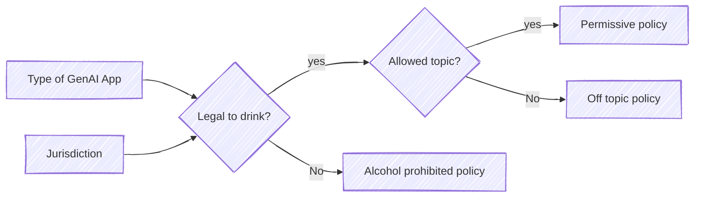
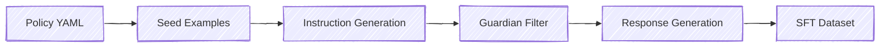

# Tutorials and Our Risk Management Philosophy   

Our Policy schema and its definition can be found [here](../policy_schema/). 
If you are new to risk management, we recommend you start by checking out [Risk Management Philosophy](risk_management_philosophy.md) to get familiar with the overall approach of our Policy Tools.

You can also get some hands-on experience following these tutorials.

## Tutorials 
In this series of tutorials you'll get comfortable with the policy format and explore additional functionality to adapt models and to ensure your GenAI application is monitored to identify policy violations. 

Typically, a single model or GenAI application is governed by more than one policy.
We have included some sample policies in the [policies](../policies/) folder.
We will use some of them in the following notebooks.  

### Tutorial 1 - Getting comfortable with the policy format 
In this tutorial we showcase how to generate a policy for *handling competitor related requests* [link](../notebooks/exploring_policy_format.ipynb)  

### Tutorial 2 - Different deployment jurisdiction, different policies. Any conflicts?   
We will show how context and jurisdiction can lead to different policies, as an example we use beer related questions.
GenAI Application deployers decide the right policy related to alcohol consumption for their application.
[link](../notebooks/exploring_policy_variability.ipynb)

In this tutorial, we also show that one policy may conflict another one. Identifying these conflicts is very relevant when it comes to governance.

### Tutorial 3 - Generate Synthetic Data for Safety Refusal Training
Learn how to use [fms-dgt](https://github.com/IBM/fms-dgt) (Foundation Model Stack - Data Generation Toolkit) to generate `(harmful prompt, calibrated refusal)` pairs using your policy files.
[link](../notebooks/generate_synthetic_data_with_fms_dgt.ipynb)

This tutorial covers the 5-stage pipeline: instruction generation, deduplication, Guardian validation, response generation, and final filtering. 

### Tutorial 4 - Enforce Policies Using Granite Guardian 4.1
Policies need enforcement. Check how we enforce them using Granite Guardian [link](../notebooks/guardian_enforcement.ipynb)

