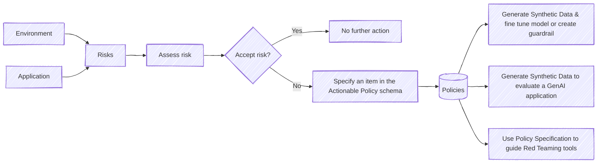

# Why GenAI Policy Tools?

When it comes to policies, one size doesn’t fit all! A policy dictates *how* to mitigate risks of interest for a particular GenAI application. Each organization and use case may need to mitigate different risks in various ways depending on the application, regulatory deployment environment, and persona interacting with the models or agents. Defining an *actionable* policy is the first step to fully manage risks. With a clear actionable policy it is possible to align models, monitor for compliance and verify before deployment the security of the system.

In this repo, we present a *Policy format* that enables the specification of policies. Coupled with these policies, we have multiple tools to enable synthetic data generation for model alignment, testing and for policy enforcement and verification at runtime. The end goal is to enable policy compliance.

In other words, the Actionable Policy allows us to:  

  ✔ Specify policies  

  ✔ Maintain all policies in a single place 

  ✔ Share policies 

  ✔ Generate synthetic data for model alignment and guardrail generation 

  ✔ Enforce policy and verify compliance 

## Why do we need a policy? Why is this different to risks frameworks? 
Risk taxonomies tell you what could go wrong, but not how to fix it. The policy tools in this repo bridge that gap with a shareable format for specifying actionable safety policies — from competitor statements to discrimination to cybersecurity risks. Define it once, then test and enforce across your GenAI stack.

To this date, a variety of risk taxonomies have been proposed. These taxonomies play an ever-important role in identifying potential risks that need to be considered before deploying a GenAI application. They are the first stepping stone to reason about safety and security. Yet, the effort cannot end there. A next step is to assess each risk to define if measures to mitigate it are needed and what are those measures. In some cases, a risk may require deploying a mitigation strategy, while in others, accepting the risk is enough. Risk management leads to *policy definitions* that dictate *what's the risk* and *what's the desired and undesirable behavior*. By defining a policy, we can effectively measure if we are adequately safeguarding a system.  

### Objective
Creating safety policies for GenAI applications is time consuming.
In this repository, our objective is to provide a common format to share safety policies in a transparent way and collect policy tools. As such, we note that the list of policies provided are not complete or applicable to all use cases. They are sample policies that we hope will enable the fast and safe deployment of GenAI applications. Policies in this repo cover both model inputs and model outputs. Please contribute! 

### Why is this important?

What you can't measure, you can't control. A first step to measure is to know what you need to verify. 
These Policy Tools are meant to ensure policy compliance and overall safety and security.
Among the benefits are: 

1. *Effective Risk Management:* Identify risks, specify how to address them and monitor for compliance. Maintaining an explicit policy provides a clear view of a taxonomy of risks and a clear stance on how to mitigate them. 
2. *Synthetic Data Generation:* Source or generate relevant synthetic data for testing or alignment purposes. 
3. *Generate guardrails:* Use synthetic data for alignment purposes in a timely manner, create reward models, adequate guardrails or evaluate GenAI applications 
4. *Assess model or GenAI application:* Guide evaluation and red teaming efforts to obtain relevant information about potential issues for the application at hand. 

Note that models are stochastic in nature; hence, there is no guarantee that there will be 100% compliance to policies. The policy is a tool for risk mitigation.

### Why a Policy Format?

The policy specifies how a language model or GenAI applications should answer a diverse set of risky questions. Different to risk taxonomies that solely list risks, this policy specifies:

1. What constitutes a risky/sensitive question
2. What can be included in an answer to a particular type of sensitive question
3. What cannot be included in the answer to such sensitive questions
4. List of types of information that can be included in an answer (this is to guide potential downstream cases where pre-canned answers are added by upper layers or to guide the synthetic data generation process)
5. Actions to be carried out, for example, log an exception when a particular question is received. Each policy type has associated an `Exception` type.
6. Version of the policy: our field moves forward very fast, so do policies. We version each file to enable compliance tracking.   

There are different ways to specify a policy. 
Our policy schema was inspired by [LavaGuard](https://github.com/ml-research/LlavaGuard) which was designed for vision models and included around eight policies. We augmented the policy specification including additional items such as versioning,
a high-level description of the risk, the definition of an `Exception` designed for easy GenAI application programming (see [notebook](../notebooks/exploring_policy_format.ipynb)) and a desired remediation.
The sample policies in this repo are also the result of consulting multiple safety benchmarks and risks taxonomies to identify relevant risks.  

Let's get some hands-on experience. Check our [tutorials](../notebooks/README.md)