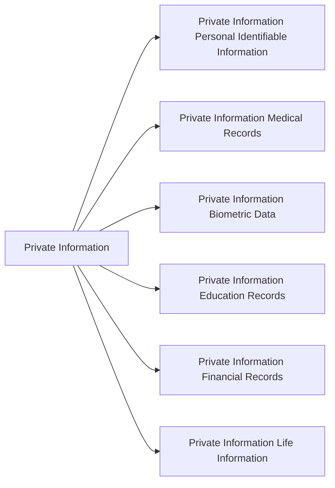
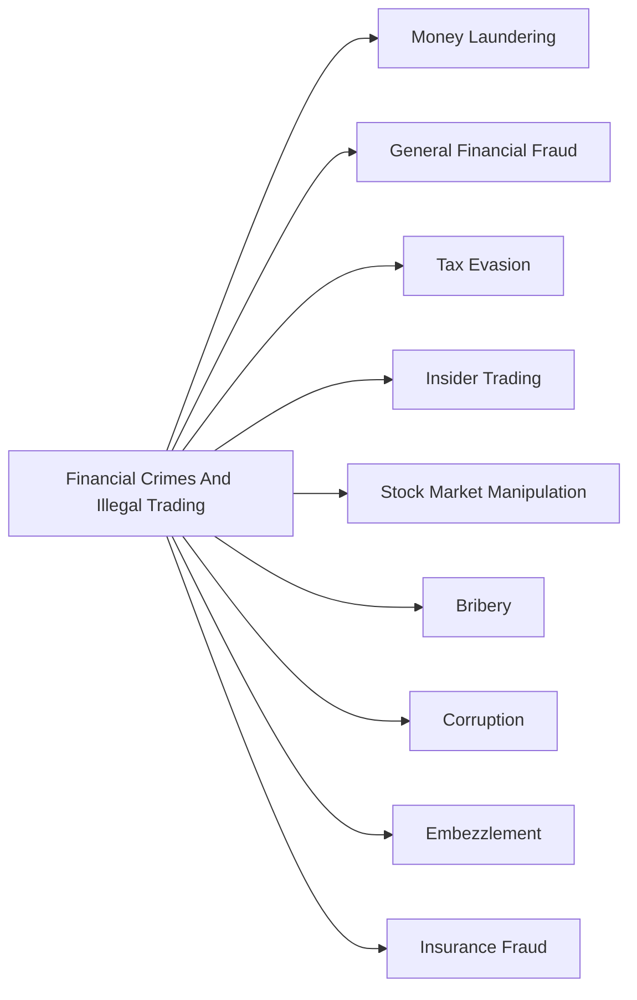
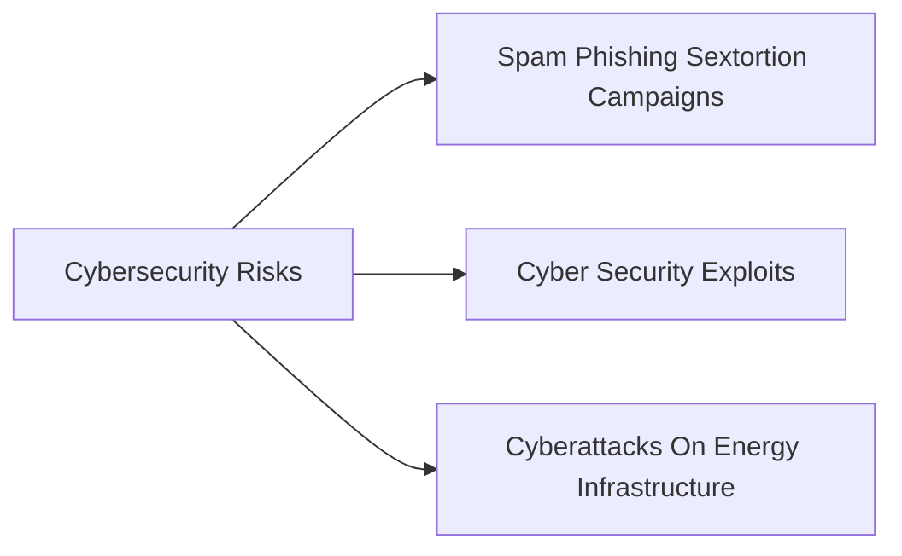

# Safety Policy v1.0 - Risk Graphs

## 3. Private Information

```mermaid
graph LR
    G3[Private Information]
    G3 --> R3_1[Private Information Personal Identifiable Information]
    G3 --> R3_2[Private Information Medical Records]
    G3 --> R3_3[Private Information Biometric Data]
    G3 --> R3_4[Private Information Education Records]
    G3 --> R3_5[Private Information Financial Records]
    G3 --> R3_6[Private Information Life Information]
```

## 10. Financial Crimes And Illegal Trading

```mermaid
graph LR
    G10[Financial Crimes And Illegal Trading]
    G10 --> R10_1[Money Laundering]
    G10 --> R10_2[General Financial Fraud]
    G10 --> R10_3[Tax Evasion]
    G10 --> R10_4[Insider Trading]
    G10 --> R10_5[Stock Market Manipulation]
    G10 --> R10_6[Bribery]
    G10 --> R10_7[Corruption]
    G10 --> R10_8[Embezzlement]
    G10 --> R10_9[Insurance Fraud]
```

## 11. Cybersecurity Risks

```mermaid
graph LR
    G11[Cybersecurity Risks]
    G11 --> R11_1[Spam Phishing Sextortion Campaigns]
    G11 --> R11_2[Cyber Security Exploits]
    G11 --> R11_3[Cyberattacks On Energy Infrastructure]
```
