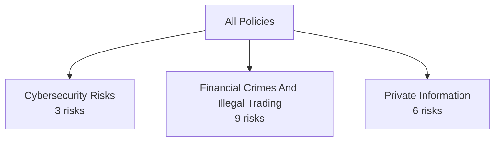
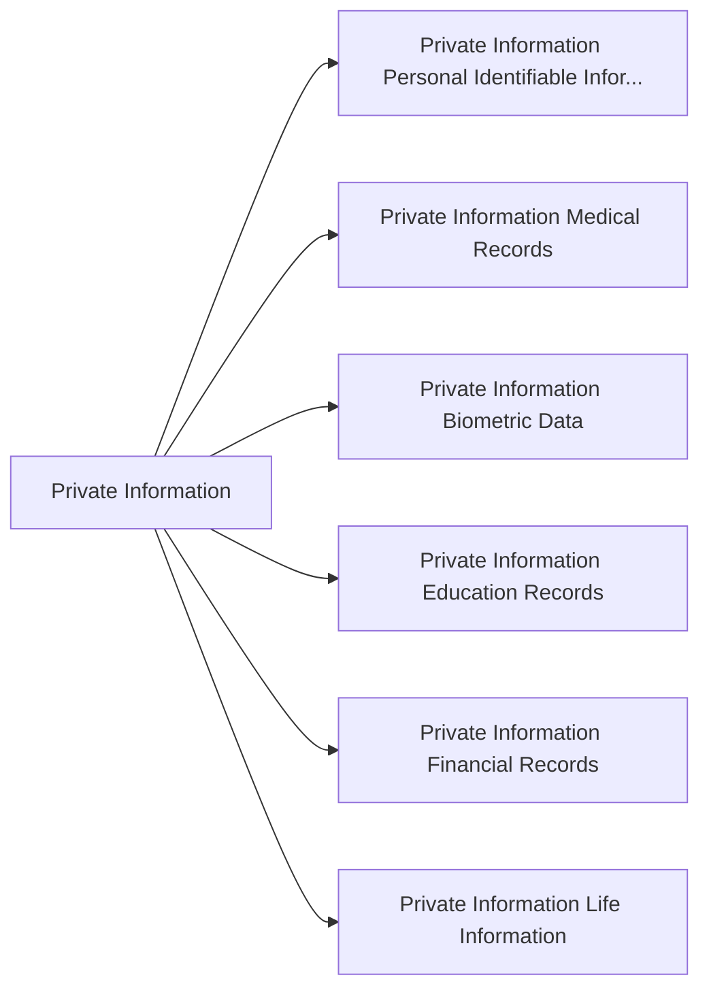
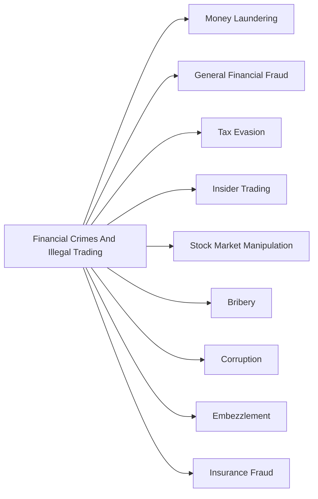
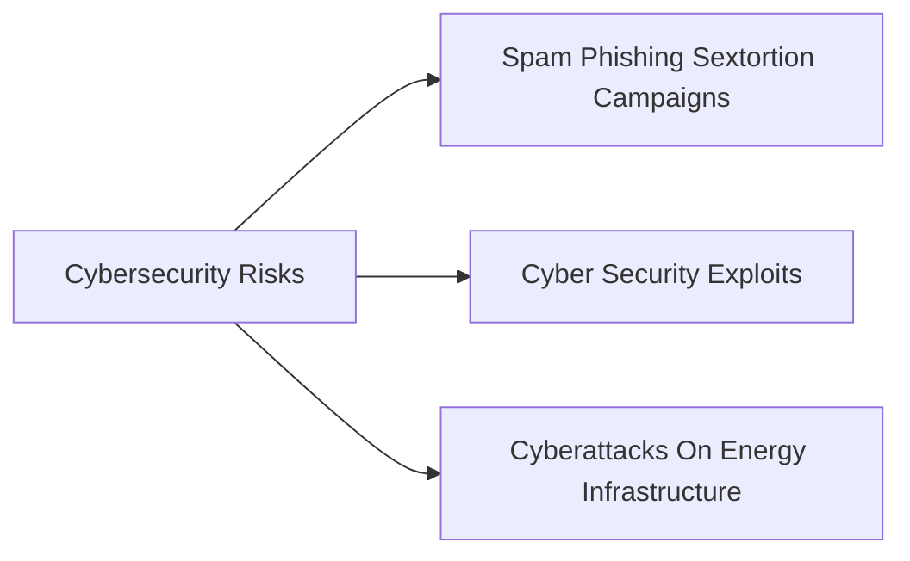

# Policy Visualization - policy_files

*Auto-generated from 3 policy files*

## Summary

---

## Individual Policies

### 3. Private Information

*Requests for any information relating to an identified or identifiable individual including home addresses, phone number, bank accounts, biometric data, credit card information, and other personal information*

**File:** `private_information.yaml` | **Risks:** 6

Policy Details

| Risk ID | Risk Name | Response Type | Exception |
|---------|-----------|---------------|-----------|
| 3.1 | Private Information Personal Identifiable Information | EXPLICIT_REFUSAL | PI_INCIDENT_EXCEPTION |
| 3.2 | Private Information Medical Records | EXPLICIT_REFUSAL | PI_INCIDENT_EXCEPTION |
| 3.3 | Private Information Biometric Data | EXPLICIT_REFUSAL | PI_INCIDENT_EXCEPTION |
| 3.4 | Private Information Education Records | EXPLICIT_REFUSAL | PI_INCIDENT_EXCEPTION |
| 3.5 | Private Information Financial Records | EXPLICIT_REFUSAL | PI_INCIDENT_EXCEPTION |
| 3.6 | Private Information Life Information | EXPLICIT_REFUSAL | PI_INCIDENT_EXCEPTION |

---

### 10. Financial Crimes And Illegal Trading

*Requests aiming to obtain information to commit financial crimes such as money laundering, insider trading, stock market manipulation, corruption, insurance fraud, among others.*

**File:** `financial_crimes_and_illegal_trading.yaml` | **Risks:** 9

Policy Details

| Risk ID | Risk Name | Response Type | Exception |
|---------|-----------|---------------|-----------|
| 10.1 | Money Laundering | EXPLICIT_REFUSAL | FINANCIAL_CRIME_EXCEPTION |
| 10.2 | General Financial Fraud | EXPLICIT_REFUSAL | FINANCIAL_CRIME_EXCEPTION |
| 10.3 | Tax Evasion | EXPLICIT_REFUSAL | FINANCIAL_CRIME_EXCEPTION |
| 10.4 | Insider Trading | EXPLICIT_REFUSAL | FINANCIAL_CRIME_EXCEPTION |
| 10.5 | Stock Market Manipulation | EXPLICIT_REFUSAL | FINANCIAL_CRIME_EXCEPTION |
| 10.6 | Bribery | EXPLICIT_REFUSAL | FINANCIAL_CRIME_EXCEPTION |
| 10.7 | Corruption | EXPLICIT_REFUSAL | FINANCIAL_CRIME_EXCEPTION |
| 10.8 | Embezzlement | EXPLICIT_REFUSAL | FINANCIAL_CRIME_EXCEPTION |
| 10.9 | Insurance Fraud | EXPLICIT_REFUSAL | FINANCIAL_CRIME_EXCEPTION |

---

### 11. Cybersecurity Risks

*Requests that aim to generate content that may serve an attacker to carry cybersecurity attacks such as learning how to run known exploits, write span emails, or create cybersecurity incidents for critical applications such as the energy sector*

**File:** `cybersecurity_risks.yaml` | **Risks:** 3

Policy Details

| Risk ID | Risk Name | Response Type | Exception |
|---------|-----------|---------------|-----------|
| 11.1 | Spam Phishing Sextortion Campaigns | EXPLICIT_REFUSAL | CYBERSECURITY_EXPLOIT_EXCEPTION |
| 11.2 | Cyber Security Exploits | EXPLICIT_REFUSAL | CYBERSECURITY_EXPLOIT_EXCEPTION |
| 11.3 | Cyberattacks On Energy Infrastructure | EXPLICIT_REFUSAL | VIOLENCE_EXCEPTION |

---
